# iotDNA Authentication Node

The iotDNA Authentication Node allows ForgeRock users to integrate their AM instance with ImageWare's "device fingerprinting" technology known as "iotDNA". The first part of the integration uses a stand-alone collection of iotDNA ReST calls to enroll a device; the second part then uses said device as part of the Authentication Tree described below.

This document assumes that you already have:
> 1. an AM 5.5+ instance running with a user base configured
> 2. an Android Wear device on which to install the verification APK at https://github.com/javaservlets/iotDnaWearable
> 3. installed the User Attribute Authentication Node (https://github.com/javaservlets/userAttribute)
> 4. installed the Queue Reader Node (https://github.com/javaservlets/queueAuthNode)
> 5. access to an instance of iotDNA

## Configuration in iotDNA

At a high-level, in iotDNA via the following calls first get an access token, then based on a device's serial number (see #2 above) coupled with a user's name, enroll it. The result will be a GUID which will be needed during the 'verify' call which takes place later in the Authentication Node. 

Thus for a user 'demo' with a wearable serial number of '601KPZK0343037'

A. curl -X POST https://{your iotDNA server address}/usermanager/oauth/token -d 'scope=IGNORED&grant_type=client_credentials' -H 'Content-Type: application/x-www-form-urlencoded' -H 'Authorization: Basic {your base64 encoded credentials}'

= **{result 1}**

B. curl -X POST --header 'Content-Type: application/json' --header 'Accept: application/json' --header 'Authorization: Bearer {result 1}' -d '{ "allowDuplicate": true, "categories": [ "apk" ], "signature": {"signature":"demo601KPZK0343037"} }' 'https://{your iotDNA server address}/tenant/1/iot/enroll'

= **{result 2}**

C. Update in ForgeRock the user's attribute of **sunIdentityMSISDNNumber** with **{result 2}**. This will be checked later by the Authentication Node configured next below.

## Configuration in ForgeRock

1. In a new browser window login into the AM console as an administrator and go to `Realms > Top Level Real > Authentication > Trees`.

2. Click on the **Add Tree** button. Name the tree iotDNA and click **Create**.

3. Add the tree node **Success** to the canvas
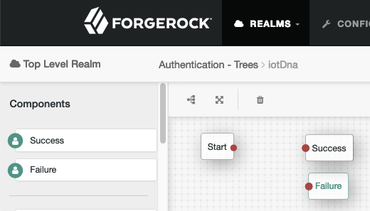

4. Add **Username Collector** node to the canvas and connect it's input originating from the **Start** node and it's output connect to the **Success node**
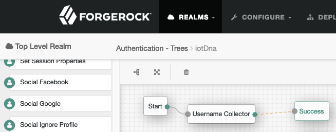

5. Click on the **Save** button in the upper left corner
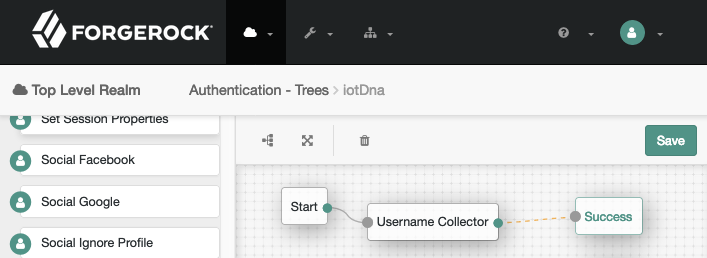

6. Add the tree node **User Attribute** to the canvas. Fill in the values for your **Server Address** and **Attribute Name** (note the out of the box attribute used is 'sunIdentityMSISDNNumber')
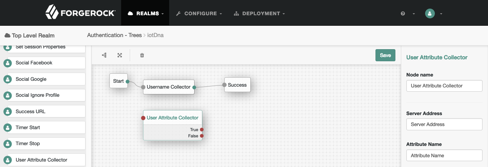

7. Configure these nodes as shown in this image:
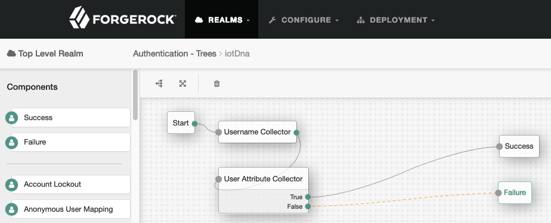

8. Click the **Save** button on the canvas (see image above in step #5).

9. Add the tree node **Queue Reader** to the canvas. Fill in the values for a. your message server (note the out of the box value is https://forgerockip.firebaseio.com) and b. the suitable number of minutes (ie, 2) till the message expires
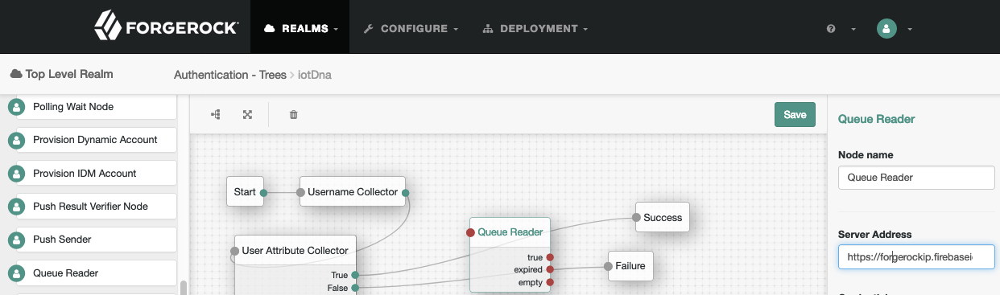

10. Configure these nodes as shown in this image, and lick the **Save** button on the canvas:
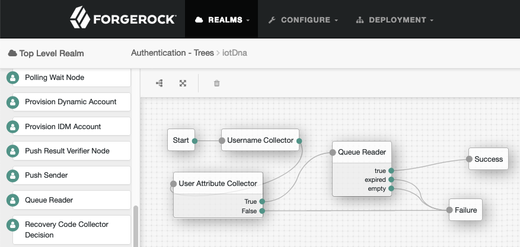

11. Add the tree node **iotDNA Node** to the canvas. Fill in the value fors **iotDnaAddress** and **iotDna Bearer** (from step B above). Configure these nodes as shown in this image:
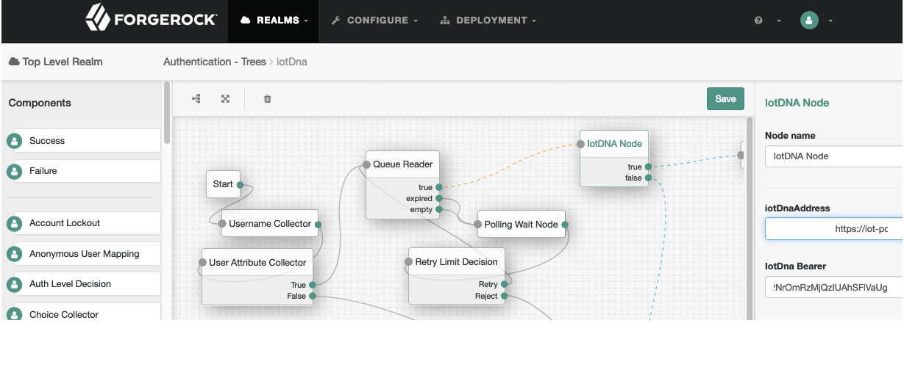

12. Add the tree node **Polling Wait Node**. Under the **Waiting Message** attribute, enter 'en' for the key and 'Open your wearable now' for the value and make sure to then click the **+** followed by the **add** button.
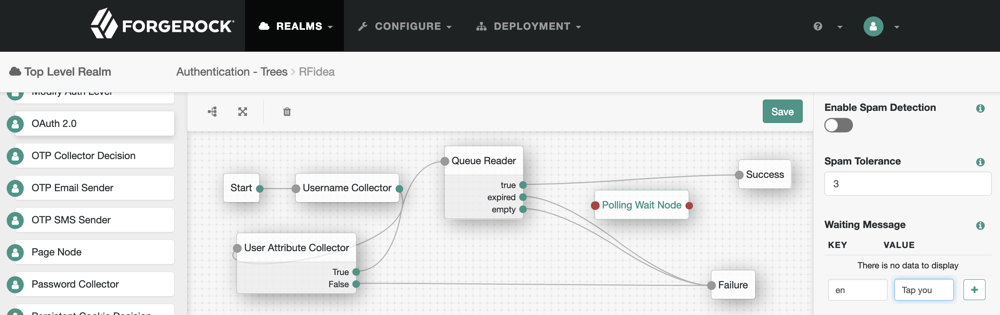

13. Add the tree node **Retry Limit Decision** and configure these nodes as shown in this image, and then click **Save**:
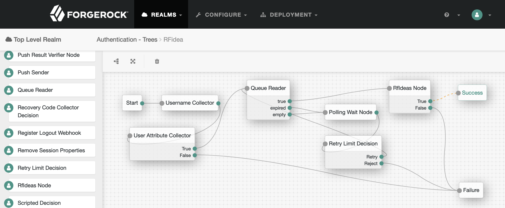

## Verification in a browser
1. In a new private browser window navigate to http:(your AM instance name)/openam/XUI/#login&service=iotDNA . Enter a user's name that has been enrolled with the GUID mentioned above in step C.
 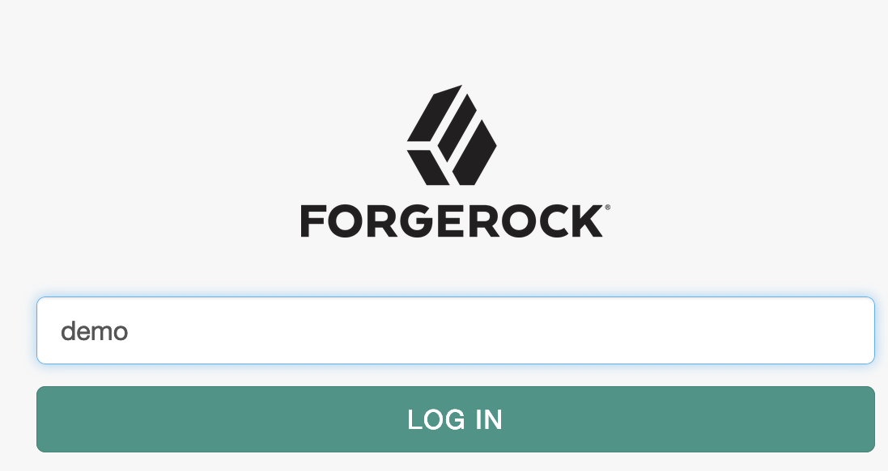

## Verification on your Watch
1. The last step is to run the Wearable APK as described at https://github.com/javaservlets/iotDnaWearable
